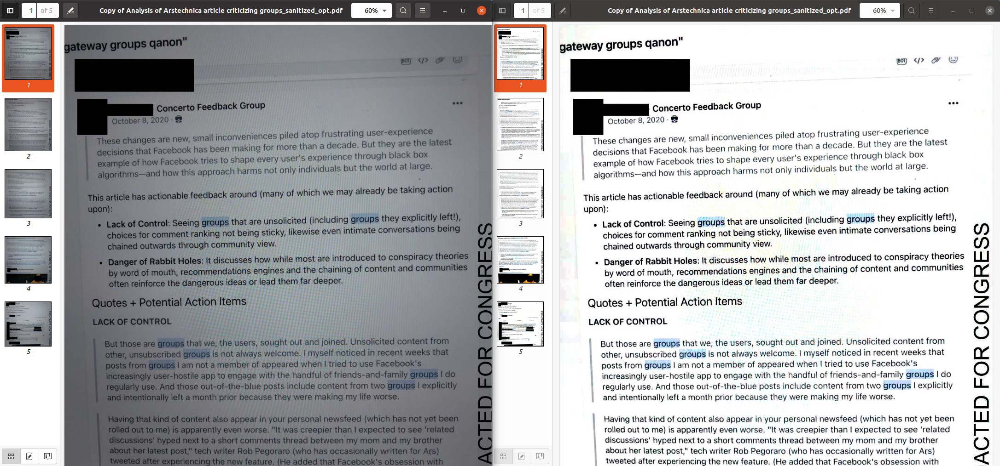

# Quick and Dirty OCR of Facebook Papers

Gizmodo has been [working through the Facebook Papers](https://gizmodo.com/hey-kid-wanna-see-some-leaked-facebook-docs-1847936740 "Gizmodo's live blog on teh Facebook Papers") and releasing the docs that they process and review.

As luck would have it, I had some ugly but functional code lying around that would do a first pass on OCR on these docs. The initial release used that code, but based on some helpful feedback I was able to make some improvements, and the updated code is in  That code is in the `pdf_scan.py` script. As always, suggestions for improvement are welcome.

The Facebook Papers are especially challenging from an OCR perspective because many of them are pictures taken of a screen, so the base image quality isn't especially good. Because of this, not every document can be processed cleanly, and the documents that do get processed have some cruft in them.

With that said, the text pulled from these files simplifies the process of parsing through a large amount of data for keywords.

# Where are the cleaned up docs?

The `processed_text` directory contains the cleaned files. Specifically, this directory contains:

* cleaned up pdfs
* the text extracted from the pdfs

The text extraction quality is decent, but there are still artifacts and cruft. 

# Other (Better) Options

This OCR should be seen as a first step. Text files are generally a decent starting point because they allow for a wide range of follow on analysis.

And, [other/better options](https://twitter.com/knowtheory/status/1453193346441101314 "Other options - Datashare in particular is on my shortlist") exist. For a comprehensive, contained analysis, these other options will almost certainly be a better choice.

# Want to help?

If you want to collaborate on this project, [let me know](https://github.com/billfitzgerald/facebook_papers_ocr/issues/new "Let me know in the issue queue if you want to help")! 
